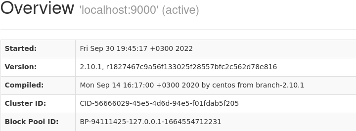
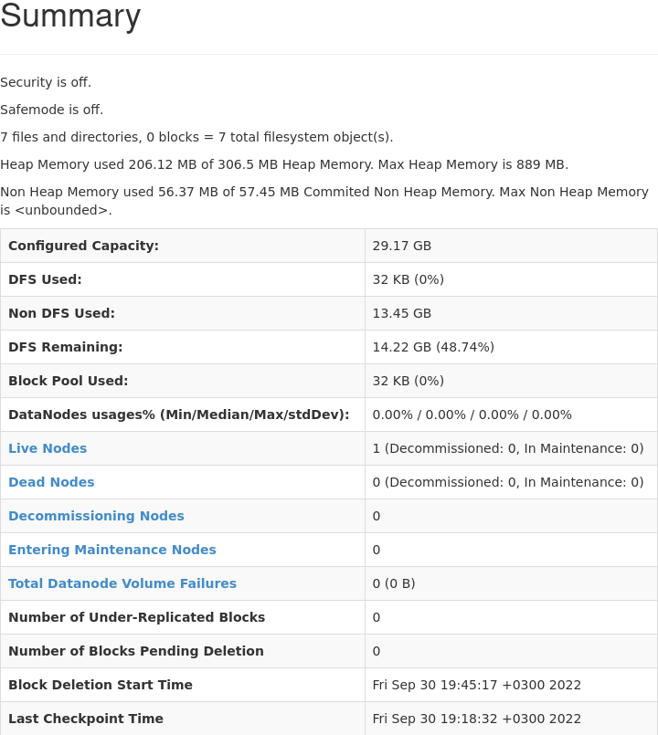
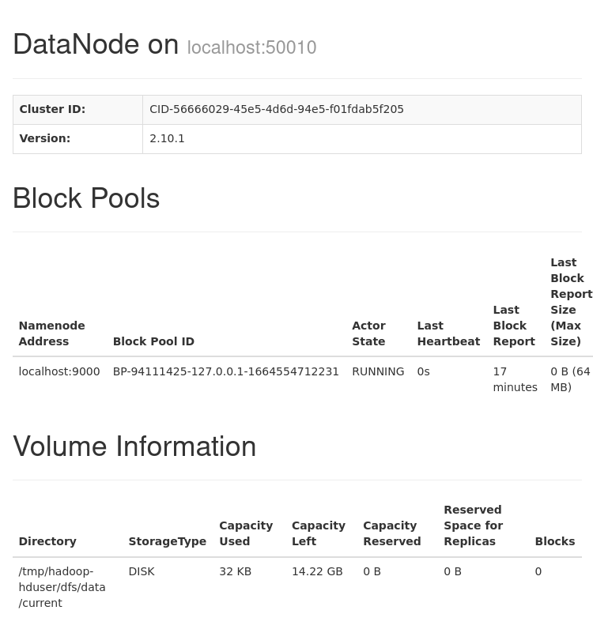
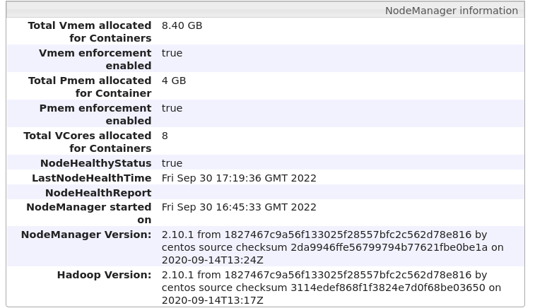
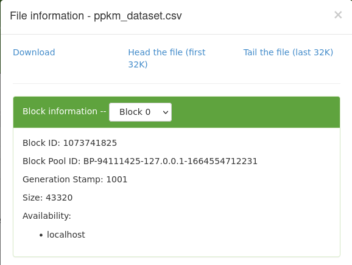

# Разверните у себя hadoop кластер внутри docker контейнера (1 балл)

1. Установка Docker

   ```shell
   mhq@mhq-envy:~$ curl -s https://get.docker.com/ | sudo sh
   ```
<!--
   # Executing docker install script, commit: 4f282167c425347a931ccfd95cc91fab041d414f
   + sh -c apt-get update -qq >/dev/null
   + sh -c DEBIAN_FRONTEND=noninteractive apt-get install -y -qq apt-transport-https ca-certificates curl >/dev/null
   + sh -c mkdir -p /etc/apt/keyrings && chmod -R 0755 /etc/apt/keyrings
   + sh -c curl -fsSL "https://download.docker.com/linux/ubuntu/gpg" | gpg --dearmor --yes -o /etc/apt/keyrings/docker.gpg
   + sh -c chmod a+r /etc/apt/keyrings/docker.gpg
   + sh -c echo "deb [arch=amd64 signed-by=/etc/apt/keyrings/docker.gpg] https://download.docker.com/linux/ubuntu jammy stable" > /etc/apt/sources.list.d/docker.list
   + sh -c apt-get update -qq >/dev/null
   + sh -c DEBIAN_FRONTEND=noninteractive apt-get install -y -qq --no-install-recommends docker-ce docker-ce-cli containerd.io docker-compose-plugin docker-scan-plugin >/dev/null
   + version_gte 20.10
   + [ -z  ]
   + return 0
   + sh -c DEBIAN_FRONTEND=noninteractive apt-get install -y -qq docker-ce-rootless-extras >/dev/null
 -->
   ```
   mhq@mhq-envy:~$ docker version
   [sudo] password for mhq: 
   Sorry, try again.
   [sudo] password for mhq: 
   Client: Docker Engine - Community
    Version:           20.10.18
    API version:       1.41
    Go version:        go1.18.6
    Git commit:        b40c2f6
    Built:             Thu Sep  8 23:11:43 2022
    OS/Arch:           linux/amd64
    Context:           default
    Experimental:      true
   
   Server: Docker Engine - Community
    Engine:
     Version:          20.10.18
     API version:      1.41 (minimum version 1.12)
     Go version:       go1.18.6
     Git commit:       e42327a
     Built:            Thu Sep  8 23:09:30 2022
     OS/Arch:          linux/amd64
     Experimental:     false
    containerd:
     Version:          1.6.8
     GitCommit:        9cd3357b7fd7218e4aec3eae239db1f68a5a6ec6
    runc:
     Version:          1.1.4
     GitCommit:        v1.1.4-0-g5fd4c4d
    docker-init:
     Version:          0.19.0
     GitCommit:        de40ad0
   ```
   <!--
   ================================================================================
   
   To run Docker as a non-privileged user, consider setting up the
   Docker daemon in rootless mode for your user:
   
       dockerd-rootless-setuptool.sh install
   
   Visit https://docs.docker.com/go/rootless/ to learn about rootless mode.
   
   
   To run the Docker daemon as a fully privileged service, but granting non-root
   users access, refer to https://docs.docker.com/go/daemon-access/
   
   WARNING: Access to the remote API on a privileged Docker daemon is equivalent
            to root access on the host. Refer to the 'Docker daemon attack surface'
            documentation for details: https://docs.docker.com/go/attack-surface/
   
   ================================================================================
   ```
    -->
  
   Проверка:
   
   ```shell
   mhq@mhq-envy:~$ docker compose version
   Docker Compose version v2.10.2
   ```

2. Развертывание Hadoop

   Docker-образ Hadoop распакован в директорию `$HADOOP_PATH`. Сборка образа:
   
   ```shell
   $ cd $HADOOP_PATH
   $ docker build -t img-hdp-hadoop .
   <OUTPUT TRIMMED FOR BREVITY>
   Successfully built 573156a441d0
   Successfully tagged img-hdp-hadoop:latest
   ```
   
   Проверим список образов:
   
   ```
   mhq@mhq-envy:~$ docker images
   REPOSITORY       TAG       IMAGE ID       CREATED          SIZE
   img-hdp-hadoop   latest    573156a441d0   16 minutes ago   1.82GB
   ubuntu           18.04     35b3f4f76a24   3 weeks ago      63.1MB
   ```
   
   Запустим контейнер:
   
   ```
   mhq@mhq-envy:~$ docker run -it --name hdp \
   -p 50090:50090 \
   -p 50075:50075 \
   -p 50070:50070 \
   -p 8042:8042 \
   -p 8088:8088 \
   -p 8888:8888 \
   -p 4040:4040 \
   -p 4044:4044 \
   --hostname localhost \
   img-hdp-hadoop
   ```

<!--

   ```
    * Starting OpenBSD Secure Shell server sshd                                                                                                                                           [ OK ] 
   22/09/30 16:18:31 INFO namenode.NameNode: STARTUP_MSG: 
   /************************************************************
   STARTUP_MSG: Starting NameNode
   STARTUP_MSG:   host = localhost/127.0.0.1
   STARTUP_MSG:   args = [-format]
   STARTUP_MSG:   version = 2.10.1
   STARTUP_MSG:   classpath = /home/hduser/hadoop/etc/hadoop:/home/hduser/hadoop/share/hadoop/common/lib/api-util-1.0.0-M20.jar:/home/hduser/hadoop/share/hadoop/common/lib/jetty-6.1.26.jar:/home/hduser/hadoop/share/hadoop/common/lib/stax-api-1.0-2.jar:/home/hduser/hadoop/share/hadoop/common/lib/java-xmlbuilder-0.4.jar:/home/hduser/hadoop/share/hadoop/common/lib/commons-math3-3.1.1.jar:/home/hduser/hadoop/share/hadoop/common/lib/jersey-core-1.9.jar:/home/hduser/hadoop/share/hadoop/common/lib/junit-4.11.jar:/home/hduser/hadoop/share/hadoop/common/lib/xmlenc-0.52.jar:/home/hduser/hadoop/share/hadoop/common/lib/commons-lang-2.6.jar:/home/hduser/hadoop/share/hadoop/common/lib/jettison-1.1.jar:/home/hduser/hadoop/share/hadoop/common/lib/commons-compress-1.19.jar:/home/hduser/hadoop/share/hadoop/common/lib/avro-1.7.7.jar:/home/hduser/hadoop/share/hadoop/common/lib/commons-digester-1.8.jar:/home/hduser/hadoop/share/hadoop/common/lib/jsp-api-2.1.jar:/home/hduser/hadoop/share/hadoop/common/lib/hadoop-annotations-2.10.1.jar:/home/hduser/hadoop/share/hadoop/common/lib/jaxb-api-2.2.2.jar:/home/hduser/hadoop/share/hadoop/common/lib/guava-11.0.2.jar:/home/hduser/hadoop/share/hadoop/common/lib/protobuf-java-2.5.0.jar:/home/hduser/hadoop/share/hadoop/common/lib/activation-1.1.jar:/home/hduser/hadoop/share/hadoop/common/lib/commons-net-3.1.jar:/home/hduser/hadoop/share/hadoop/common/lib/jets3t-0.9.0.jar:/home/hduser/hadoop/share/hadoop/common/lib/json-smart-1.3.1.jar:/home/hduser/hadoop/share/hadoop/common/lib/httpcore-4.4.4.jar:/home/hduser/hadoop/share/hadoop/common/lib/commons-logging-1.1.3.jar:/home/hduser/hadoop/share/hadoop/common/lib/jackson-mapper-asl-1.9.13.jar:/home/hduser/hadoop/share/hadoop/common/lib/servlet-api-2.5.jar:/home/hduser/hadoop/share/hadoop/common/lib/commons-configuration-1.6.jar:/home/hduser/hadoop/share/hadoop/common/lib/commons-collections-3.2.2.jar:/home/hduser/hadoop/share/hadoop/common/lib/stax2-api-3.1.4.jar:/home/hduser/hadoop/share/hadoop/common/lib/apacheds-kerberos-codec-2.0.0-M15.jar:/home/hduser/hadoop/share/hadoop/common/lib/curator-client-2.13.0.jar:/home/hduser/hadoop/share/hadoop/common/lib/jaxb-impl-2.2.3-1.jar:/home/hduser/hadoop/share/hadoop/common/lib/mockito-all-1.8.5.jar:/home/hduser/hadoop/share/hadoop/common/lib/jetty-util-6.1.26.jar:/home/hduser/hadoop/share/hadoop/common/lib/log4j-1.2.17.jar:/home/hduser/hadoop/share/hadoop/common/lib/asm-3.2.jar:/home/hduser/hadoop/share/hadoop/common/lib/jetty-sslengine-6.1.26.jar:/home/hduser/hadoop/share/hadoop/common/lib/htrace-core4-4.1.0-incubating.jar:/home/hduser/hadoop/share/hadoop/common/lib/commons-beanutils-1.9.4.jar:/home/hduser/hadoop/share/hadoop/common/lib/hadoop-auth-2.10.1.jar:/home/hduser/hadoop/share/hadoop/common/lib/slf4j-log4j12-1.7.25.jar:/home/hduser/hadoop/share/hadoop/common/lib/paranamer-2.3.jar:/home/hduser/hadoop/share/hadoop/common/lib/jersey-server-1.9.jar:/home/hduser/hadoop/share/hadoop/common/lib/curator-recipes-2.13.0.jar:/home/hduser/hadoop/share/hadoop/common/lib/jcip-annotations-1.0-1.jar:/home/hduser/hadoop/share/hadoop/common/lib/zookeeper-3.4.14.jar:/home/hduser/hadoop/share/hadoop/common/lib/slf4j-api-1.7.25.jar:/home/hduser/hadoop/share/hadoop/common/lib/jsr305-3.0.2.jar:/home/hduser/hadoop/share/hadoop/common/lib/commons-codec-1.4.jar:/home/hduser/hadoop/share/hadoop/common/lib/snappy-java-1.0.5.jar:/home/hduser/hadoop/share/hadoop/common/lib/hamcrest-core-1.3.jar:/home/hduser/hadoop/share/hadoop/common/lib/netty-3.10.6.Final.jar:/home/hduser/hadoop/share/hadoop/common/lib/jsch-0.1.55.jar:/home/hduser/hadoop/share/hadoop/common/lib/audience-annotations-0.5.0.jar:/home/hduser/hadoop/share/hadoop/common/lib/commons-cli-1.2.jar:/home/hduser/hadoop/share/hadoop/common/lib/jersey-json-1.9.jar:/home/hduser/hadoop/share/hadoop/common/lib/curator-framework-2.13.0.jar:/home/hduser/hadoop/share/hadoop/common/lib/jackson-jaxrs-1.9.13.jar:/home/hduser/hadoop/share/hadoop/common/lib/spotbugs-annotations-3.1.9.jar:/home/hduser/hadoop/share/hadoop/common/lib/woodstox-core-5.0.3.jar:/home/hduser/hadoop/share/hadoop/common/lib/jackson-xc-1.9.13.jar:/home/hduser/hadoop/share/hadoop/common/lib/apacheds-i18n-2.0.0-M15.jar:/home/hduser/hadoop/share/hadoop/common/lib/api-asn1-api-1.0.0-M20.jar:/home/hduser/hadoop/share/hadoop/common/lib/jackson-core-asl-1.9.13.jar:/home/hduser/hadoop/share/hadoop/common/lib/httpclient-4.5.2.jar:/home/hduser/hadoop/share/hadoop/common/lib/commons-lang3-3.4.jar:/home/hduser/hadoop/share/hadoop/common/lib/nimbus-jose-jwt-7.9.jar:/home/hduser/hadoop/share/hadoop/common/lib/commons-io-2.4.jar:/home/hduser/hadoop/share/hadoop/common/lib/gson-2.2.4.jar:/home/hduser/hadoop/share/hadoop/common/hadoop-common-2.10.1.jar:/home/hduser/hadoop/share/hadoop/common/hadoop-common-2.10.1-tests.jar:/home/hduser/hadoop/share/hadoop/common/hadoop-nfs-2.10.1.jar:/home/hduser/hadoop/share/hadoop/hdfs:/home/hduser/hadoop/share/hadoop/hdfs/lib/jetty-6.1.26.jar:/home/hduser/hadoop/share/hadoop/hdfs/lib/jersey-core-1.9.jar:/home/hduser/hadoop/share/hadoop/hdfs/lib/okhttp-2.7.5.jar:/home/hduser/hadoop/share/hadoop/hdfs/lib/xmlenc-0.52.jar:/home/hduser/hadoop/share/hadoop/hdfs/lib/commons-lang-2.6.jar:/home/hduser/hadoop/share/hadoop/hdfs/lib/leveldbjni-all-1.8.jar:/home/hduser/hadoop/share/hadoop/hdfs/lib/xml-apis-1.4.01.jar:/home/hduser/hadoop/share/hadoop/hdfs/lib/okio-1.6.0.jar:/home/hduser/hadoop/share/hadoop/hdfs/lib/xercesImpl-2.12.0.jar:/home/hduser/hadoop/share/hadoop/hdfs/lib/guava-11.0.2.jar:/home/hduser/hadoop/share/hadoop/hdfs/lib/protobuf-java-2.5.0.jar:/home/hduser/hadoop/share/hadoop/hdfs/lib/jackson-core-2.9.10.jar:/home/hduser/hadoop/share/hadoop/hdfs/lib/commons-logging-1.1.3.jar:/home/hduser/hadoop/share/hadoop/hdfs/lib/jackson-mapper-asl-1.9.13.jar:/home/hduser/hadoop/share/hadoop/hdfs/lib/servlet-api-2.5.jar:/home/hduser/hadoop/share/hadoop/hdfs/lib/jetty-util-6.1.26.jar:/home/hduser/hadoop/share/hadoop/hdfs/lib/log4j-1.2.17.jar:/home/hduser/hadoop/share/hadoop/hdfs/lib/asm-3.2.jar:/home/hduser/hadoop/share/hadoop/hdfs/lib/htrace-core4-4.1.0-incubating.jar:/home/hduser/hadoop/share/hadoop/hdfs/lib/jersey-server-1.9.jar:/home/hduser/hadoop/share/hadoop/hdfs/lib/commons-daemon-1.0.13.jar:/home/hduser/hadoop/share/hadoop/hdfs/lib/jsr305-3.0.2.jar:/home/hduser/hadoop/share/hadoop/hdfs/lib/commons-codec-1.4.jar:/home/hduser/hadoop/share/hadoop/hdfs/lib/netty-3.10.6.Final.jar:/home/hduser/hadoop/share/hadoop/hdfs/lib/hadoop-hdfs-client-2.10.1.jar:/home/hduser/hadoop/share/hadoop/hdfs/lib/netty-all-4.1.50.Final.jar:/home/hduser/hadoop/share/hadoop/hdfs/lib/jackson-databind-2.9.10.6.jar:/home/hduser/hadoop/share/hadoop/hdfs/lib/commons-cli-1.2.jar:/home/hduser/hadoop/share/hadoop/hdfs/lib/jackson-core-asl-1.9.13.jar:/home/hduser/hadoop/share/hadoop/hdfs/lib/commons-io-2.4.jar:/home/hduser/hadoop/share/hadoop/hdfs/lib/jackson-annotations-2.9.10.jar:/home/hduser/hadoop/share/hadoop/hdfs/hadoop-hdfs-native-client-2.10.1-tests.jar:/home/hduser/hadoop/share/hadoop/hdfs/hadoop-hdfs-2.10.1.jar:/home/hduser/hadoop/share/hadoop/hdfs/hadoop-hdfs-native-client-2.10.1.jar:/home/hduser/hadoop/share/hadoop/hdfs/hadoop-hdfs-rbf-2.10.1.jar:/home/hduser/hadoop/share/hadoop/hdfs/hadoop-hdfs-nfs-2.10.1.jar:/home/hduser/hadoop/share/hadoop/hdfs/hadoop-hdfs-client-2.10.1.jar:/home/hduser/hadoop/share/hadoop/hdfs/hadoop-hdfs-rbf-2.10.1-tests.jar:/home/hduser/hadoop/share/hadoop/hdfs/hadoop-hdfs-client-2.10.1-tests.jar:/home/hduser/hadoop/share/hadoop/hdfs/hadoop-hdfs-2.10.1-tests.jar:/home/hduser/hadoop/share/hadoop/yarn:/home/hduser/hadoop/share/hadoop/yarn/lib/mssql-jdbc-6.2.1.jre7.jar:/home/hduser/hadoop/share/hadoop/yarn/lib/HikariCP-java7-2.4.12.jar:/home/hduser/hadoop/share/hadoop/yarn/lib/api-util-1.0.0-M20.jar:/home/hduser/hadoop/share/hadoop/yarn/lib/jetty-6.1.26.jar:/home/hduser/hadoop/share/hadoop/yarn/lib/jersey-client-1.9.jar:/home/hduser/hadoop/share/hadoop/yarn/lib/stax-api-1.0-2.jar:/home/hduser/hadoop/share/hadoop/yarn/lib/geronimo-jcache_1.0_spec-1.0-alpha-1.jar:/home/hduser/hadoop/share/hadoop/yarn/lib/java-xmlbuilder-0.4.jar:/home/hduser/hadoop/share/hadoop/yarn/lib/commons-math3-3.1.1.jar:/home/hduser/hadoop/share/hadoop/yarn/lib/jersey-core-1.9.jar:/home/hduser/hadoop/share/hadoop/yarn/lib/xmlenc-0.52.jar:/home/hduser/hadoop/share/hadoop/yarn/lib/commons-lang-2.6.jar:/home/hduser/hadoop/share/hadoop/yarn/lib/leveldbjni-all-1.8.jar:/home/hduser/hadoop/share/hadoop/yarn/lib/jettison-1.1.jar:/home/hduser/hadoop/share/hadoop/yarn/lib/commons-compress-1.19.jar:/home/hduser/hadoop/share/hadoop/yarn/lib/avro-1.7.7.jar:/home/hduser/hadoop/share/hadoop/yarn/lib/commons-digester-1.8.jar:/home/hduser/hadoop/share/hadoop/yarn/lib/jsp-api-2.1.jar:/home/hduser/hadoop/share/hadoop/yarn/lib/jaxb-api-2.2.2.jar:/home/hduser/hadoop/share/hadoop/yarn/lib/ehcache-3.3.1.jar:/home/hduser/hadoop/share/hadoop/yarn/lib/guava-11.0.2.jar:/home/hduser/hadoop/share/hadoop/yarn/lib/protobuf-java-2.5.0.jar:/home/hduser/hadoop/share/hadoop/yarn/lib/activation-1.1.jar:/home/hduser/hadoop/share/hadoop/yarn/lib/commons-net-3.1.jar:/home/hduser/hadoop/share/hadoop/yarn/lib/guice-servlet-3.0.jar:/home/hduser/hadoop/share/hadoop/yarn/lib/jets3t-0.9.0.jar:/home/hduser/hadoop/share/hadoop/yarn/lib/json-smart-1.3.1.jar:/home/hduser/hadoop/share/hadoop/yarn/lib/httpcore-4.4.4.jar:/home/hduser/hadoop/share/hadoop/yarn/lib/commons-logging-1.1.3.jar:/home/hduser/hadoop/share/hadoop/yarn/lib/jersey-guice-1.9.jar:/home/hduser/hadoop/share/hadoop/yarn/lib/jackson-mapper-asl-1.9.13.jar:/home/hduser/hadoop/share/hadoop/yarn/lib/servlet-api-2.5.jar:/home/hduser/hadoop/share/hadoop/yarn/lib/commons-configuration-1.6.jar:/home/hduser/hadoop/share/hadoop/yarn/lib/commons-collections-3.2.2.jar:/home/hduser/hadoop/share/hadoop/yarn/lib/aopalliance-1.0.jar:/home/hduser/hadoop/share/hadoop/yarn/lib/stax2-api-3.1.4.jar:/home/hduser/hadoop/share/hadoop/yarn/lib/apacheds-kerberos-codec-2.0.0-M15.jar:/home/hduser/hadoop/share/hadoop/yarn/lib/curator-client-2.13.0.jar:/home/hduser/hadoop/share/hadoop/yarn/lib/jaxb-impl-2.2.3-1.jar:/home/hduser/hadoop/share/hadoop/yarn/lib/metrics-core-3.0.1.jar:/home/hduser/hadoop/share/hadoop/yarn/lib/jetty-util-6.1.26.jar:/home/hduser/hadoop/share/hadoop/yarn/lib/log4j-1.2.17.jar:/home/hduser/hadoop/share/hadoop/yarn/lib/asm-3.2.jar:/home/hduser/hadoop/share/hadoop/yarn/lib/jetty-sslengine-6.1.26.jar:/home/hduser/hadoop/share/hadoop/yarn/lib/htrace-core4-4.1.0-incubating.jar:/home/hduser/hadoop/share/hadoop/yarn/lib/json-io-2.5.1.jar:/home/hduser/hadoop/share/hadoop/yarn/lib/javax.inject-1.jar:/home/hduser/hadoop/share/hadoop/yarn/lib/commons-beanutils-1.9.4.jar:/home/hduser/hadoop/share/hadoop/yarn/lib/paranamer-2.3.jar:/home/hduser/hadoop/share/hadoop/yarn/lib/jersey-server-1.9.jar:/home/hduser/hadoop/share/hadoop/yarn/lib/curator-recipes-2.13.0.jar:/home/hduser/hadoop/share/hadoop/yarn/lib/jcip-annotations-1.0-1.jar:/home/hduser/hadoop/share/hadoop/yarn/lib/zookeeper-3.4.14.jar:/home/hduser/hadoop/share/hadoop/yarn/lib/fst-2.50.jar:/home/hduser/hadoop/share/hadoop/yarn/lib/jsr305-3.0.2.jar:/home/hduser/hadoop/share/hadoop/yarn/lib/commons-codec-1.4.jar:/home/hduser/hadoop/share/hadoop/yarn/lib/snappy-java-1.0.5.jar:/home/hduser/hadoop/share/hadoop/yarn/lib/netty-3.10.6.Final.jar:/home/hduser/hadoop/share/hadoop/yarn/lib/jsch-0.1.55.jar:/home/hduser/hadoop/share/hadoop/yarn/lib/audience-annotations-0.5.0.jar:/home/hduser/hadoop/share/hadoop/yarn/lib/guice-3.0.jar:/home/hduser/hadoop/share/hadoop/yarn/lib/commons-cli-1.2.jar:/home/hduser/hadoop/share/hadoop/yarn/lib/jersey-json-1.9.jar:/home/hduser/hadoop/share/hadoop/yarn/lib/curator-framework-2.13.0.jar:/home/hduser/hadoop/share/hadoop/yarn/lib/jackson-jaxrs-1.9.13.jar:/home/hduser/hadoop/share/hadoop/yarn/lib/spotbugs-annotations-3.1.9.jar:/home/hduser/hadoop/share/hadoop/yarn/lib/woodstox-core-5.0.3.jar:/home/hduser/hadoop/share/hadoop/yarn/lib/java-util-1.9.0.jar:/home/hduser/hadoop/share/hadoop/yarn/lib/jackson-xc-1.9.13.jar:/home/hduser/hadoop/share/hadoop/yarn/lib/apacheds-i18n-2.0.0-M15.jar:/home/hduser/hadoop/share/hadoop/yarn/lib/api-asn1-api-1.0.0-M20.jar:/home/hduser/hadoop/share/hadoop/yarn/lib/jackson-core-asl-1.9.13.jar:/home/hduser/hadoop/share/hadoop/yarn/lib/httpclient-4.5.2.jar:/home/hduser/hadoop/share/hadoop/yarn/lib/commons-lang3-3.4.jar:/home/hduser/hadoop/share/hadoop/yarn/lib/nimbus-jose-jwt-7.9.jar:/home/hduser/hadoop/share/hadoop/yarn/lib/commons-io-2.4.jar:/home/hduser/hadoop/share/hadoop/yarn/lib/gson-2.2.4.jar:/home/hduser/hadoop/share/hadoop/yarn/hadoop-yarn-registry-2.10.1.jar:/home/hduser/hadoop/share/hadoop/yarn/hadoop-yarn-server-sharedcachemanager-2.10.1.jar:/home/hduser/hadoop/share/hadoop/yarn/hadoop-yarn-server-applicationhistoryservice-2.10.1.jar:/home/hduser/hadoop/share/hadoop/yarn/hadoop-yarn-server-web-proxy-2.10.1.jar:/home/hduser/hadoop/share/hadoop/yarn/hadoop-yarn-api-2.10.1.jar:/home/hduser/hadoop/share/hadoop/yarn/hadoop-yarn-server-tests-2.10.1.jar:/home/hduser/hadoop/share/hadoop/yarn/hadoop-yarn-server-common-2.10.1.jar:/home/hduser/hadoop/share/hadoop/yarn/hadoop-yarn-server-resourcemanager-2.10.1.jar:/home/hduser/hadoop/share/hadoop/yarn/hadoop-yarn-applications-distributedshell-2.10.1.jar:/home/hduser/hadoop/share/hadoop/yarn/hadoop-yarn-client-2.10.1.jar:/home/hduser/hadoop/share/hadoop/yarn/hadoop-yarn-server-nodemanager-2.10.1.jar:/home/hduser/hadoop/share/hadoop/yarn/hadoop-yarn-common-2.10.1.jar:/home/hduser/hadoop/share/hadoop/yarn/hadoop-yarn-server-timeline-pluginstorage-2.10.1.jar:/home/hduser/hadoop/share/hadoop/yarn/hadoop-yarn-applications-unmanaged-am-launcher-2.10.1.jar:/home/hduser/hadoop/share/hadoop/yarn/hadoop-yarn-server-router-2.10.1.jar:/home/hduser/hadoop/share/hadoop/mapreduce/lib/jersey-core-1.9.jar:/home/hduser/hadoop/share/hadoop/mapreduce/lib/junit-4.11.jar:/home/hduser/hadoop/share/hadoop/mapreduce/lib/leveldbjni-all-1.8.jar:/home/hduser/hadoop/share/hadoop/mapreduce/lib/commons-compress-1.19.jar:/home/hduser/hadoop/share/hadoop/mapreduce/lib/avro-1.7.7.jar:/home/hduser/hadoop/share/hadoop/mapreduce/lib/hadoop-annotations-2.10.1.jar:/home/hduser/hadoop/share/hadoop/mapreduce/lib/protobuf-java-2.5.0.jar:/home/hduser/hadoop/share/hadoop/mapreduce/lib/guice-servlet-3.0.jar:/home/hduser/hadoop/share/hadoop/mapreduce/lib/jersey-guice-1.9.jar:/home/hduser/hadoop/share/hadoop/mapreduce/lib/jackson-mapper-asl-1.9.13.jar:/home/hduser/hadoop/share/hadoop/mapreduce/lib/aopalliance-1.0.jar:/home/hduser/hadoop/share/hadoop/mapreduce/lib/log4j-1.2.17.jar:/home/hduser/hadoop/share/hadoop/mapreduce/lib/asm-3.2.jar:/home/hduser/hadoop/share/hadoop/mapreduce/lib/javax.inject-1.jar:/home/hduser/hadoop/share/hadoop/mapreduce/lib/paranamer-2.3.jar:/home/hduser/hadoop/share/hadoop/mapreduce/lib/jersey-server-1.9.jar:/home/hduser/hadoop/share/hadoop/mapreduce/lib/snappy-java-1.0.5.jar:/home/hduser/hadoop/share/hadoop/mapreduce/lib/hamcrest-core-1.3.jar:/home/hduser/hadoop/share/hadoop/mapreduce/lib/netty-3.10.6.Final.jar:/home/hduser/hadoop/share/hadoop/mapreduce/lib/guice-3.0.jar:/home/hduser/hadoop/share/hadoop/mapreduce/lib/jackson-core-asl-1.9.13.jar:/home/hduser/hadoop/share/hadoop/mapreduce/lib/commons-io-2.4.jar:/home/hduser/hadoop/share/hadoop/mapreduce/hadoop-mapreduce-client-app-2.10.1.jar:/home/hduser/hadoop/share/hadoop/mapreduce/hadoop-mapreduce-client-core-2.10.1.jar:/home/hduser/hadoop/share/hadoop/mapreduce/hadoop-mapreduce-client-shuffle-2.10.1.jar:/home/hduser/hadoop/share/hadoop/mapreduce/hadoop-mapreduce-examples-2.10.1.jar:/home/hduser/hadoop/share/hadoop/mapreduce/hadoop-mapreduce-client-hs-plugins-2.10.1.jar:/home/hduser/hadoop/share/hadoop/mapreduce/hadoop-mapreduce-client-common-2.10.1.jar:/home/hduser/hadoop/share/hadoop/mapreduce/hadoop-mapreduce-client-hs-2.10.1.jar:/home/hduser/hadoop/share/hadoop/mapreduce/hadoop-mapreduce-client-jobclient-2.10.1.jar:/home/hduser/hadoop/share/hadoop/mapreduce/hadoop-mapreduce-client-jobclient-2.10.1-tests.jar:/home/hduser/hadoop/contrib/capacity-scheduler/*.jar
   STARTUP_MSG:   build = https://github.com/apache/hadoop -r 1827467c9a56f133025f28557bfc2c562d78e816; compiled by 'centos' on 2020-09-14T13:17Z
   STARTUP_MSG:   java = 1.8.0_342
   ************************************************************/
   22/09/30 16:18:31 INFO namenode.NameNode: registered UNIX signal handlers for [TERM, HUP, INT]
   22/09/30 16:18:31 INFO namenode.NameNode: createNameNode [-format]
   Formatting using clusterid: CID-56666029-45e5-4d6d-94e5-f01fdab5f205
   22/09/30 16:18:31 INFO namenode.FSEditLog: Edit logging is async:true
   22/09/30 16:18:31 INFO namenode.FSNamesystem: KeyProvider: null
   22/09/30 16:18:31 INFO namenode.FSNamesystem: fsLock is fair: true
   22/09/30 16:18:31 INFO namenode.FSNamesystem: Detailed lock hold time metrics enabled: false
   22/09/30 16:18:31 INFO namenode.FSNamesystem: fsOwner             = hduser (auth:SIMPLE)
   22/09/30 16:18:31 INFO namenode.FSNamesystem: supergroup          = supergroup
   22/09/30 16:18:31 INFO namenode.FSNamesystem: isPermissionEnabled = false
   22/09/30 16:18:31 INFO namenode.FSNamesystem: HA Enabled: false
   22/09/30 16:18:32 INFO common.Util: dfs.datanode.fileio.profiling.sampling.percentage set to 0. Disabling file IO profiling
   22/09/30 16:18:32 INFO blockmanagement.DatanodeManager: dfs.block.invalidate.limit: configured=1000, counted=60, effected=1000
   22/09/30 16:18:32 INFO blockmanagement.DatanodeManager: dfs.namenode.datanode.registration.ip-hostname-check=true
   22/09/30 16:18:32 INFO blockmanagement.BlockManager: dfs.namenode.startup.delay.block.deletion.sec is set to 000:00:00:00.000
   22/09/30 16:18:32 INFO blockmanagement.BlockManager: The block deletion will start around 2022 Sep 30 16:18:32
   22/09/30 16:18:32 INFO util.GSet: Computing capacity for map BlocksMap
   22/09/30 16:18:32 INFO util.GSet: VM type       = 64-bit
   22/09/30 16:18:32 INFO util.GSet: 2.0% max memory 889 MB = 17.8 MB
   22/09/30 16:18:32 INFO util.GSet: capacity      = 2^21 = 2097152 entries
   22/09/30 16:18:32 INFO blockmanagement.BlockManager: dfs.block.access.token.enable=false
   22/09/30 16:18:32 WARN conf.Configuration: No unit for dfs.heartbeat.interval(3) assuming SECONDS
   22/09/30 16:18:32 WARN conf.Configuration: No unit for dfs.namenode.safemode.extension(30000) assuming MILLISECONDS
   22/09/30 16:18:32 INFO blockmanagement.BlockManagerSafeMode: dfs.namenode.safemode.threshold-pct = 0.9990000128746033
   22/09/30 16:18:32 INFO blockmanagement.BlockManagerSafeMode: dfs.namenode.safemode.min.datanodes = 0
   22/09/30 16:18:32 INFO blockmanagement.BlockManagerSafeMode: dfs.namenode.safemode.extension = 30000
   22/09/30 16:18:32 INFO blockmanagement.BlockManager: defaultReplication         = 1
   22/09/30 16:18:32 INFO blockmanagement.BlockManager: maxReplication             = 512
   22/09/30 16:18:32 INFO blockmanagement.BlockManager: minReplication             = 1
   22/09/30 16:18:32 INFO blockmanagement.BlockManager: maxReplicationStreams      = 2
   22/09/30 16:18:32 INFO blockmanagement.BlockManager: replicationRecheckInterval = 3000
   22/09/30 16:18:32 INFO blockmanagement.BlockManager: encryptDataTransfer        = false
   22/09/30 16:18:32 INFO blockmanagement.BlockManager: maxNumBlocksToLog          = 1000
   22/09/30 16:18:32 INFO namenode.FSNamesystem: Append Enabled: true
   22/09/30 16:18:32 INFO namenode.FSDirectory: GLOBAL serial map: bits=24 maxEntries=16777215
   22/09/30 16:18:32 INFO util.GSet: Computing capacity for map INodeMap
   22/09/30 16:18:32 INFO util.GSet: VM type       = 64-bit
   22/09/30 16:18:32 INFO util.GSet: 1.0% max memory 889 MB = 8.9 MB
   22/09/30 16:18:32 INFO util.GSet: capacity      = 2^20 = 1048576 entries
   22/09/30 16:18:32 INFO namenode.FSDirectory: ACLs enabled? false
   22/09/30 16:18:32 INFO namenode.FSDirectory: XAttrs enabled? true
   22/09/30 16:18:32 INFO namenode.NameNode: Caching file names occurring more than 10 times
   22/09/30 16:18:32 INFO snapshot.SnapshotManager: Loaded config captureOpenFiles: falseskipCaptureAccessTimeOnlyChange: false
   22/09/30 16:18:32 INFO util.GSet: Computing capacity for map cachedBlocks
   22/09/30 16:18:32 INFO util.GSet: VM type       = 64-bit
   22/09/30 16:18:32 INFO util.GSet: 0.25% max memory 889 MB = 2.2 MB
   22/09/30 16:18:32 INFO util.GSet: capacity      = 2^18 = 262144 entries
   22/09/30 16:18:32 INFO metrics.TopMetrics: NNTop conf: dfs.namenode.top.window.num.buckets = 10
   22/09/30 16:18:32 INFO metrics.TopMetrics: NNTop conf: dfs.namenode.top.num.users = 10
   22/09/30 16:18:32 INFO metrics.TopMetrics: NNTop conf: dfs.namenode.top.windows.minutes = 1,5,25
   22/09/30 16:18:32 INFO namenode.FSNamesystem: Retry cache on namenode is enabled
   22/09/30 16:18:32 INFO namenode.FSNamesystem: Retry cache will use 0.03 of total heap and retry cache entry expiry time is 600000 millis
   22/09/30 16:18:32 INFO util.GSet: Computing capacity for map NameNodeRetryCache
   22/09/30 16:18:32 INFO util.GSet: VM type       = 64-bit
   22/09/30 16:18:32 INFO util.GSet: 0.029999999329447746% max memory 889 MB = 273.1 KB
   22/09/30 16:18:32 INFO util.GSet: capacity      = 2^15 = 32768 entries
   22/09/30 16:18:32 INFO namenode.FSImage: Allocated new BlockPoolId: BP-94111425-127.0.0.1-1664554712231
   22/09/30 16:18:32 INFO common.Storage: Storage directory /tmp/hadoop-hduser/dfs/name has been successfully formatted.
   22/09/30 16:18:32 INFO namenode.FSImageFormatProtobuf: Saving image file /tmp/hadoop-hduser/dfs/name/current/fsimage.ckpt_0000000000000000000 using no compression
   22/09/30 16:18:32 INFO namenode.FSImageFormatProtobuf: Image file /tmp/hadoop-hduser/dfs/name/current/fsimage.ckpt_0000000000000000000 of size 324 bytes saved in 0 seconds .
   22/09/30 16:18:32 INFO namenode.NNStorageRetentionManager: Going to retain 1 images with txid >= 0
   22/09/30 16:18:32 INFO namenode.FSImage: FSImageSaver clean checkpoint: txid = 0 when meet shutdown.
   22/09/30 16:18:32 INFO namenode.NameNode: SHUTDOWN_MSG: 
   /************************************************************
   SHUTDOWN_MSG: Shutting down NameNode at localhost/127.0.0.1
   ************************************************************/
   Starting namenodes on [localhost]
   localhost: Warning: Permanently added 'localhost' (ECDSA) to the list of known hosts.
   localhost: starting namenode, logging to /home/hduser/hadoop/logs/hadoop-hduser-namenode-localhost.out
   localhost: Warning: Permanently added 'localhost' (ECDSA) to the list of known hosts.
   localhost: starting datanode, logging to /home/hduser/hadoop/logs/hadoop-hduser-datanode-localhost.out
   Starting secondary namenodes [0.0.0.0]
   0.0.0.0: Warning: Permanently added '0.0.0.0' (ECDSA) to the list of known hosts.
   0.0.0.0: starting secondarynamenode, logging to /home/hduser/hadoop/logs/hadoop-hduser-secondarynamenode-localhost.out
   starting yarn daemons
   starting resourcemanager, logging to /home/hduser/hadoop/logs/yarn--resourcemanager-localhost.out
   localhost: Warning: Permanently added 'localhost' (ECDSA) to the list of known hosts.
   localhost: starting nodemanager, logging to /home/hduser/hadoop/logs/yarn-hduser-nodemanager-localhost.out
   ```
-->

Команда для второго и следующих запусков:

```
mhq@mhq-envy:~$ docker start hdp -i
 * Starting OpenBSD Secure Shell server sshd [ OK ] 
Starting namenodes on [localhost]
localhost: Warning: Permanently added 'localhost' (ECDSA) to the list of known hosts.
localhost: starting namenode, logging to /home/hduser/hadoop/logs/hadoop-hduser-namenode-localhost.out
localhost: Warning: Permanently added 'localhost' (ECDSA) to the list of known hosts.
localhost: starting datanode, logging to /home/hduser/hadoop/logs/hadoop-hduser-datanode-localhost.out
Starting secondary namenodes [0.0.0.0]
0.0.0.0: Warning: Permanently added '0.0.0.0' (ECDSA) to the list of known hosts.
0.0.0.0: starting secondarynamenode, logging to /home/hduser/hadoop/logs/hadoop-hduser-secondarynamenode-localhost.out
starting yarn daemons
starting resourcemanager, logging to /home/hduser/hadoop/logs/yarn--resourcemanager-localhost.out
localhost: Warning: Permanently added 'localhost' (ECDSA) to the list of known hosts.
localhost: starting nodemanager, logging to /home/hduser/hadoop/logs/yarn-hduser-nodemanager-localhost.out
```

<!--
Удаляем контейнер и образ

$ docker rm hdp
$ docker rmi img-hdp-hadoop
$ docker system prune
 -->

# Проверьте работоспособность кластера, посмотрев на статус ресурс менеджера, нейм ноды и дата ноды (1 балл)

Кластер готов к работе (рис. 1--4).

{width=70%}

{width=70%}

{width=70%}

{width=70%}

# Поместите датасет ppkm_sentiment у себя в HDFS и дайте всем пользователям на них полные права (1 балл)

Копируем архив в ФС контейнера:

```
mhq@mhq-envy:~/Downloads$ docker cp ppkm.zip hdp:/home/hduser/
```

Распаковываем:

```
hduser@localhost:~$ unzip ppkm.zip -d ppkm && rm ppkm.zip
ppkm:  ppkm.zip
  inflating: ppkm/ppkm_dataset.csv   
  inflating: ppkm/ppkm_test.csv      
  inflating: ppkm/stopwordv1.txt     
hduser@localhost:~$ ls
hadoop  ppkm
```

Копируем директорию `ppkm` в hdfs:

```
hduser@localhost:~$ hdfs dfs -put ppkm /user/hduser/
```

Даем полные права на файлы датасета всем пользователям:

```
hduser@localhost:~$ hdfs dfs -chmod -R a+rwx /user/hduser/ppkm
```

Проверяем:

```
hduser@localhost:~$ hdfs dfs -ls /user/hduser/ppkm
Found 3 items
-rwxrwxrwx 1 hduser supergroup 43320 2022-09-30 17:37 /user/hduser/ppkm/ppkm_dataset.csv
-rwxrwxrwx 1 hduser supergroup   476 2022-09-30 17:37 /user/hduser/ppkm/ppkm_test.csv
-rwxrwxrwx 1 hduser supergroup  4015 2022-09-30 17:37 /user/hduser/ppkm/stopwordv1.txt
```

# Определите расположение блоков файла ppkm_dataset.csv в файловой системе (3 балла)

Открываем <http://localhost:50070/explorer.html#/user/hduser/ppkm> и смотрим подробности файла:

{width=70%}

Запоминаем подробности:

```
Block ID: 1073741825
Block Pool ID: BP-94111425-127.0.0.1-1664554712231
Generation Stamp: 1001
Size: 43320
```

Находим на странице [DataNode Information](http://localhost:50075/datanode.html) в разделе _Volume Information_ в колонке _Directory_ путь к блокам:

```
/tmp/hadoop-hduser/dfs/data/current
```

Командой ls находим директорию с блоками.

```
hduser@localhost:~$ ls /tmp/hadoop-hduser/dfs/data/current/\
BP-94111425-127.0.0.1-1664554712231/current/finalized/subdir0/subdir0/
blk_1073741825  blk_1073741825_1001.meta  blk_1073741826
blk_1073741826_1002.meta  blk_1073741827  blk_1073741827_1003.meta
```

Таким образом, блок файла `ppkm_dataset.csv` хранится по пути

```
/tmp/hadoop-hduser/dfs/data/current/BP-94111425-127.0.0.1-1664554712231/
current/finalized/subdir0/subdir0/blk_1073741825
```

# У вас 20 файлов, каждый размером 130 Мб. Сколько блоков будет аллоцировано в NameNode, при условии, что размер блока по умолчанию у вас 128 Мб, а фактор репликации равен 3? (2 балла)

Один блок пренадлежит только одному файлу, файл, если он больше блока, занимает несколько. Replication Factor задает количество копий блока. Таким образом,

$$\left⌈\frac {130}{128}\right⌉ ⋅ 20 ⋅ 3 =120
$$

блоков будет аллоцировано.

# У вас 1 файл, размером 1.56 Тб. Сколько блоков будет аллоцировано в NameNode, при условии, что размер блока по умолчанию у вас 128 Мб, а фактор репликации равен 3? (2 балла)

$$1.56\text { Тб} = 1.56 ⋅ 2^{20}\text { Мб},\quad 128 = 2^7$$

$$ \left⌈\frac {1.56 ⋅ 2^{20}} {2^7}\right⌉ ⋅ 3 = 38340
$$

блоков будет аллоцировано.

P.S. Ответы на предыдущие 2 задачи будут верными, если количество DataNode $n⩾3$ (фактора репликации).
Иначе будет аллоцировано не $3×$, а $n×$ блоков, а оставшиеся $3-n$ будут в `Missing replicas`, и будут аллоцированы, как только в кластере появятся новые DataNode.